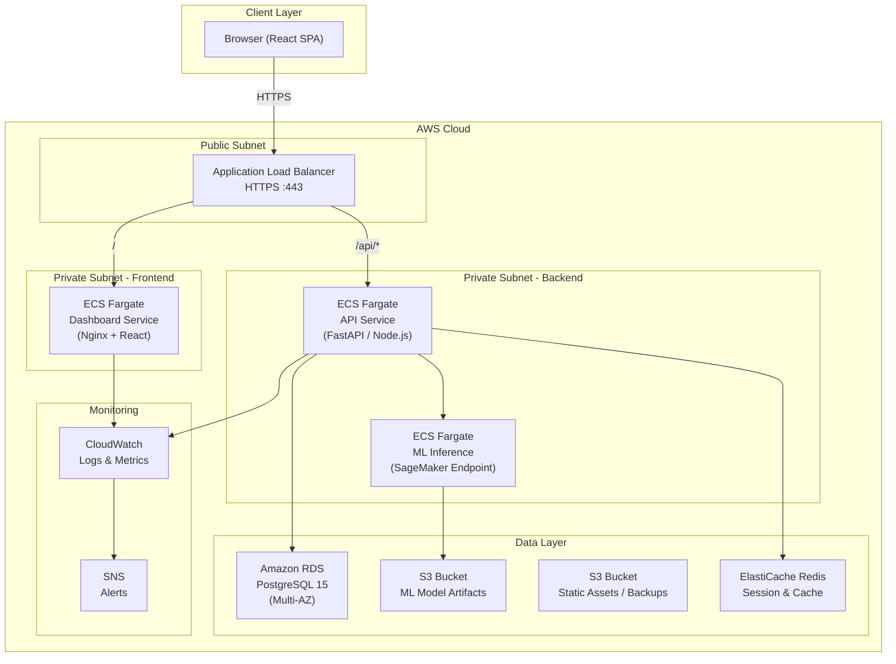
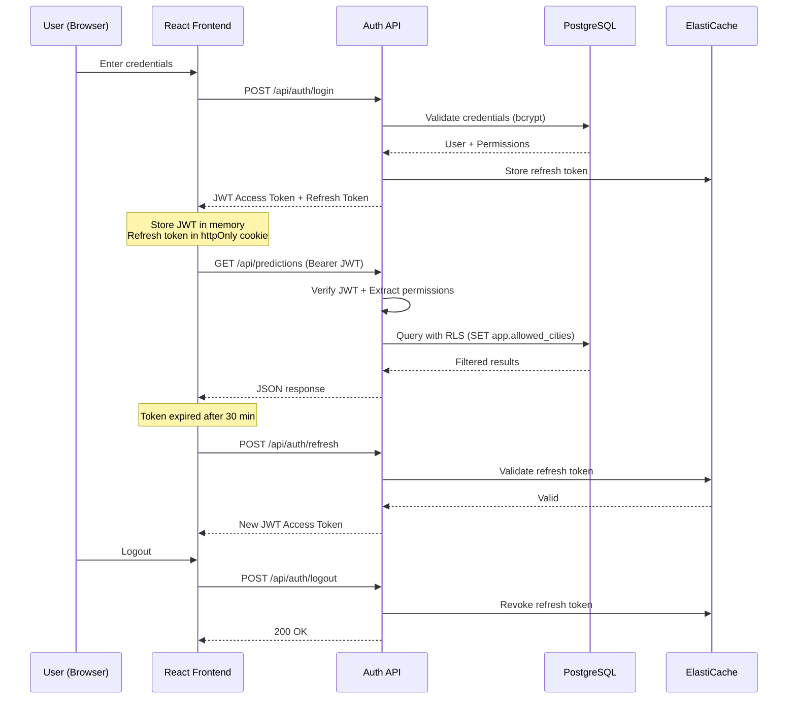
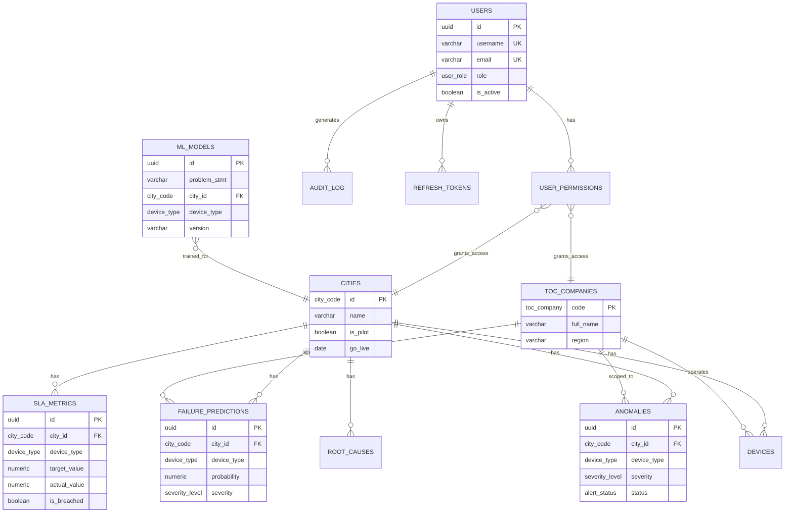
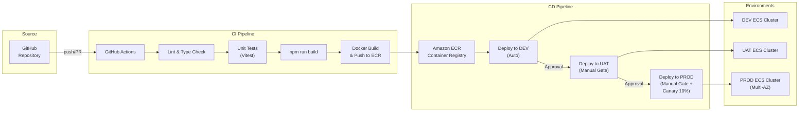
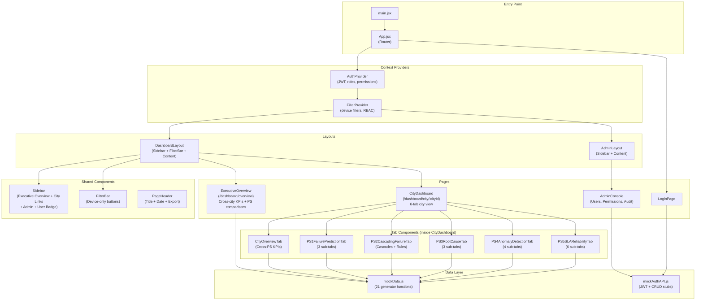
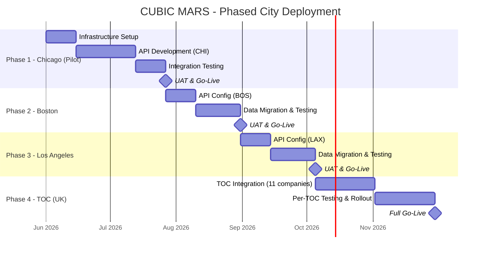
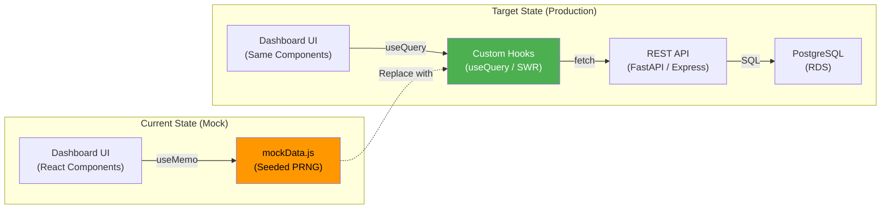

# CUBIC MARS - Architecture Diagrams

## 1. System Architecture Overview

## 2. Authentication & RBAC Flow

## 3. Database Schema (Entity Relationship)

## 4. CI/CD Deployment Pipeline

## 5. Frontend Component Architecture

## 6. Phased City Deployment

## 7. Data Flow: Mock to Production

