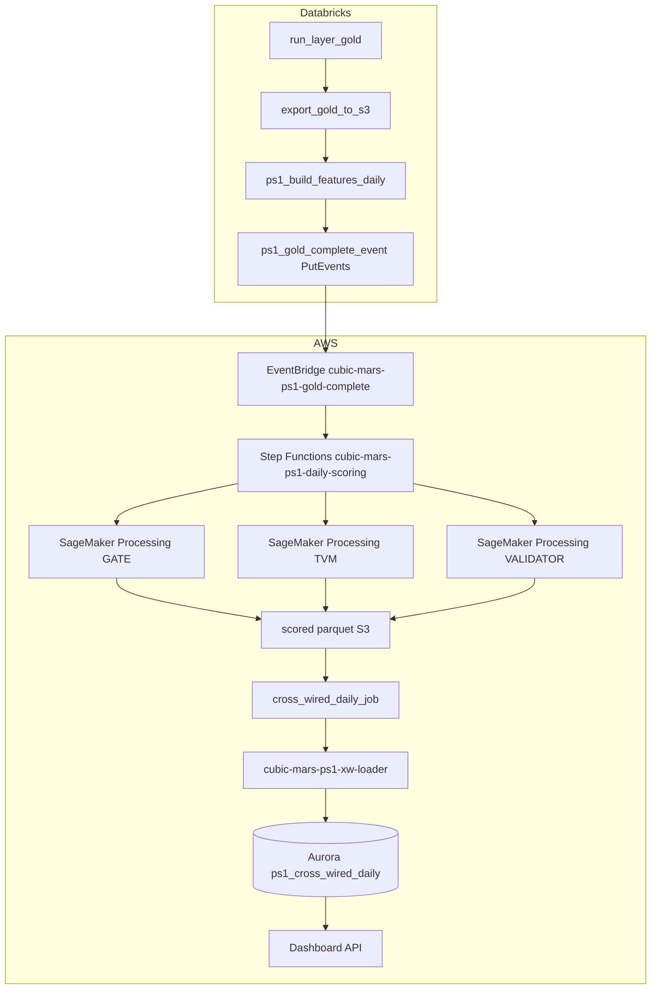
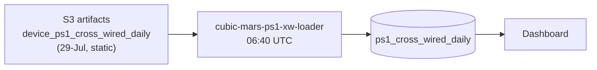

# PS1 — Failure Prediction Go-Live Guide

**Chicago MARS · TVM / GATE / VALIDATOR · Hardware OOS 3-day horizon**

| | |
|---|---|
| **Last updated** | 18-Aug-2026 |
| **Audience** | Engineers deploying or operating the PS1 daily pipeline |
| **Related docs** | [PS1_DECISIONS_15Aug2026.md](PS1_DECISIONS_15Aug2026.md), [PS1_DAILY_INFERENCE_DESIGN.md](PS1_DAILY_INFERENCE_DESIGN.md), [PS1_OPERATIONAL_INVENTORY.md](PS1_OPERATIONAL_INVENTORY.md), [PS3_GO_LIVE_GUIDE.md](PS3_GO_LIVE_GUIDE.md), [skills/PS1-PS5_Chicago_Status_Summary_17Aug2026.md](../skills/PS1-PS5_Chicago_Status_Summary_17Aug2026.md) |

---

## 1. What PS1 does

PS1 predicts whether a fare-collection device will enter **hardware out-of-service (OOS)** within the **next 3 calendar days**, using daily telemetry aggregates.

| Fleet | Device types |
|-------|----------------|
| **GATE** | Station gates |
| **TVM** | Ticket vending machines |
| **VALIDATOR** | Bus/on-board validators |

**Target column:** `will_hardware_oos_3d` (binary). A separate SLA reference column `will_fail_3d` exists for chargeable-outage context only.

**Output consumers:** V4 dashboard (`/ps1/*` routes), cross-wired export for field operations, RDS table `ps1_cross_wired_daily`.

---

## 2. Executive summary — live vs pending

### What works today (production)

The **bottom half** of the chain is live and scheduled:

```
S3 static scores (29-Jul export, data as-of ~2026-04-11)
    → cubic-mars-ps1-xw-loader  (EventBridge cron 06:40 UTC, ENABLED)
    → Aurora ps1_cross_wired_daily  (786,525 rows)
    → cubic-mars-dashboard-api  (36 /ps1/* routes)
```

The loader **re-loads the same artifact files every night**. The dashboard schedule runs, but **numbers do not advance with new Oracle data** until the top half is deployed and incremental ingest lands.

### What is built but not deployed

The **top half** — daily feature build, batch scoring, event-driven trigger — is implemented in this repo but **not wired in AWS or Databricks**:

| Component | Repo path | Deployed? |
|-----------|-----------|-----------|
| Shared feature ETL (CELLS 6–8) | `notebooks/ps1_features.py` | No |
| Daily feature job | `notebooks/ps1_build_features_daily.py` | No |
| Gold-complete EventBridge signal | `notebooks/ps1_gold_complete_event.py` | No |
| Batch scorer (Processing) | `notebooks/ps1_batch_score_daily.py` | No |
| Databricks job definitions | `databricks.yml` (`medallion_ps1_daily`) | No (PAUSED) |
| EventBridge + Step Functions scaffold | `tooling/ps1_eventbridge_build.sh`, `tooling/sfn/ps1_daily_scoring.asl.json` | Dry-run only |
| Feature contracts on S3 | `tooling/out/ps1_*_feature_contract.json` | Must be uploaded |

### Hard gate before “new day” scores matter

**Incremental Oracle ingestion (12-Apr-2026 → present)** must land in gold (~23-Aug-2026 target). Without fresh `device_ps1_daily` rows, a perfect pipeline would still score nothing new.

---

## 3. Architecture

### 3.1 Target daily flow (designed, not live)



**Key design choices (settled 15–16 Aug 2026):**

- **D-2:** Daily scoring = **SageMaker Processing job** (batch), not real-time endpoints.
- **D-3:** Trigger = **Databricks PutEvents** (“Gold Layer Complete”), never S3 bucket notifications.
- **D-9:** **Managed sklearn DLC** + pinned `requirements-ps1-scoring.txt` — no custom ECR/BYOC.
- **D-4:** Delete three real-time endpoints after first successful batch parity run.

### 3.2 Current live flow (static scores)



### 3.3 Training vs daily inference

| Activity | Where | When |
|----------|-------|------|
| **Train + register model** | Fleet notebooks `PS1_3d_{GATE,TVM,VALIDATOR}_SageMaker_MLflow_FeatureStore.ipynb` | Ad hoc / retrain |
| **Build features (training window)** | Same notebooks → `%run ../ps1_features` | During notebook ETL |
| **Build features (scoring window)** | `ps1_build_features_daily.py` | Daily, after gold export |
| **Score** | `ps1_batch_score_daily.py` (Processing) | Daily, after PutEvents |
| **Export cross-wire** | `cross_wired_daily_job.py` | After scores land |
| **Load RDS** | `cubic-mars-ps1-xw-loader` | After cross-wire S3 write |

**Important:** Production notebook CELL 20 stores the held-out **test split**; CELL 24 exports exactly that. The prefix `device_ps1_cross_wired_daily` names **row grain** (device × day), not a daily cadence. The new pipeline exists precisely to score **each new transit_day**.

---

## 4. Repository layout

### 4.1 Production notebooks (keep)

| Path | Role |
|------|------|
| `notebooks/ps1_failure_prediction/PS1_3d_GATE_SageMaker_MLflow_FeatureStore.ipynb` | GATE train / deploy / MLflow |
| `notebooks/ps1_failure_prediction/PS1_3d_TVM_SageMaker_MLflow_FeatureStore.ipynb` | TVM train / deploy / MLflow |
| `notebooks/ps1_failure_prediction/PS1_3d_VALIDATOR_SageMaker_MLflow_FeatureStore.ipynb` | VALIDATOR train / deploy / MLflow |
| `notebooks/ps1_failure_prediction/PS1_VALIDATOR_Device_Bus_Serial_Map.ipynb` | Bus/serial map for `dim_device_bus` (crews dispatch to buses) |

### 4.2 Daily pipeline (new)

| Path | Role |
|------|------|
| `notebooks/ps1_features.py` | Shared Spark ETL extracted from notebook CELLS 6–8 |
| `notebooks/ps1_build_features_daily.py` | Databricks job: writes daily feature parquet |
| `notebooks/ps1_gold_complete_event.py` | Verifies gold, emits EventBridge PutEvents |
| `notebooks/ps1_batch_score_daily.py` | SageMaker Processing scorer |
| `notebooks/requirements-ps1-scoring.txt` | Pinned deps for Processing job (incl. `xgboost==2.1.3`) |
| `notebooks/cross_wired_daily_job.py` | Assembles PS1–PS5 cross-wire export |

Regenerate `ps1_features.py` after CELL 6–8 changes:

```bash
py -3 tooling/build_ps1_features_module.py
```

(Reads notebook sources from git HEAD; patched wrapper cells in working tree do not break extraction.)

### 4.3 Tooling

| Path | Role |
|------|------|
| `tooling/ps1_eventbridge_build.sh` | Create SNS + 4 EventBridge rules + SFN skeleton (all DISABLED) |
| `tooling/ps1_cleanup.sh` | Retire endpoints, ECR lifecycle, disable no-op training rule |
| `tooling/ps1_cleanup_dryrun.ps1` | Windows-friendly cleanup dry-run |
| `tooling/upload_ps1_feature_contracts.ps1` | Upload contracts to artifacts bucket |
| `tooling/sfn/ps1_daily_scoring.asl.json` | Step Functions definition (placeholders remain) |
| `tooling/lambda/ps1_freshness_watchdog.py` | Detects “scoring never ran” (09:30 UTC) |
| `tooling/out/ps1_*_feature_contract.json` | Pinned feature lists per fleet |
| `tooling/out/endpoint_capture/` | Endpoint config captures (required before endpoint deletion) |

### 4.4 Retired (do not use for daily ops)

| Path | Reason |
|------|--------|
| `notebooks/_retired/ps1/PS1_3d_GATE_OOS_Optimized_SageMaker_v4.ipynb` | Superseded by MLflow FeatureStore notebooks |
| `notebooks/_retired/docker/` | BYOC path declined (D-9) |
| Path B `cubic-mars-ps1-rds-push` | Retired 10-Aug-2026; loader disabled |

---

## 5. S3 layout

### Buckets

| Bucket | Purpose |
|--------|---------|
| `cubic-mars-pm-s3-datalake-dev-gold-170202974600` | Gold/silver parquet exports |
| `cubic-mars-pm-s3-datalake-dev-artifacts-170202974600` | Models, features, scores, cross-wire |

### Key prefixes

| Prefix | Writer | Reader | Status |
|--------|--------|--------|--------|
| `chicago/gold/device_ps1_daily/` | `export_gold_to_s3.py` | `ps1_features.py` (spine) | Live export |
| `chicago/ps1/features/asof=<date>/fleet=<slug>/` | `ps1_build_features_daily.py` | `ps1_batch_score_daily.py` | **Not yet written daily** |
| `chicago/ps1/contracts/ps1_<fleet>_feature_contract.json` | Manual upload from `tooling/out/` | Feature + score jobs | **Upload required** |
| `chicago/ps1/scored/asof=<date>/fleet=<slug>/` | `ps1_batch_score_daily.py` | `cross_wired_daily_job.py` | **Not yet written daily** |
| `chicago/device_ps1_cross_wired_daily/{gate,tvm,validator}/` | Notebook CELL 24 (one-off) | `cubic-mars-ps1-xw-loader` | **Live, static 29-Jul** |
| `chicago/cross_wired/daily/asof=<date>/` | `cross_wired_daily_job.py` | Downstream (future) | Event-driven path |

---

## 6. AWS resources

### 6.1 SageMaker endpoints (live, idle)

| Endpoint | Fleet | Features | Threshold | Invocations (30d) |
|----------|-------|----------|-----------|-------------------|
| `chicago-ps1-3d-gate-failure-v1` | GATE | 47 | 0.12284049 | 0 |
| `chicago-ps1-3d-tvm-failure-v1` | TVM | 40 | 0.02648935 | 0 |
| `chicago-ps1-3d-validator-failure-v1` | VALIDATOR | 40 | 0.39651793 | 0 |

- **Image:** AWS managed `sagemaker-scikit-learn:1.2-1-cpu-py3` (not custom ECR).
- **ECR `cubic-pdm/mars-ps1`:** Unused; retirement approved (D-1).
- **Planned:** Delete endpoints after first batch parity run (D-4). Captures committed under `tooling/out/endpoint_capture/`.

### 6.2 Lambda loaders

| Function | Schedule | State | Path |
|----------|----------|-------|------|
| `cubic-mars-ps1-xw-loader` | `cron(40 6 * * ? *)` | **ENABLED** | Path A — live |
| `cubic-mars-ps1-rds-push` | `cron(15 6 * * ? *)` | **DISABLED** | Path B — retired |

### 6.3 EventBridge (planned, not created)

| Rule | Purpose | Initial state |
|------|---------|---------------|
| `cubic-mars-ps1-gold-complete` | Gold PutEvents → Step Functions | DISABLED |
| `cubic-mars-ps1-sfn-failed` | SFN failure → SNS | DISABLED |
| `cubic-mars-ps1-processing-failed` | Processing failure → SNS | DISABLED |
| `cubic-mars-ps1-watchdog` | No scores by 09:30 UTC → SNS | DISABLED |

Create (dry-run first):

```bash
"C:\Program Files\Git\bin\bash.exe" tooling/ps1_eventbridge_build.sh
"C:\Program Files\Git\bin\bash.exe" tooling/ps1_eventbridge_build.sh --apply
```

---

## 7. Databricks jobs

Defined in `databricks.yml`:

| Job | Chain | Schedule |
|-----|-------|----------|
| **`medallion_ps1_daily`** | gold → export S3 → build features → PutEvents | PAUSED (06:00 Chicago) |
| **`ps1_daily_pre_score`** | build features → PutEvents only | PAUSED |
| **`cross_wired_daily`** | cross-wire export | PAUSED (trigger via SFN when live) |
| **`medallion_and_cross_wire`** | Legacy name; same as `medallion_ps1_daily` (cross-wire removed) | On demand |

Deploy:

```bash
databricks bundle validate -t dev --profile "Sathish.Sankaran@cubic.com"
databricks bundle deploy -t dev --profile "Sathish.Sankaran@cubic.com"
```

Manual run (after deploy):

```bash
databricks bundle run medallion_ps1_daily -t dev --profile "Sathish.Sankaran@cubic.com"
```

**Instance profile requirements:**

- S3 read: gold bucket (`chicago/gold`, `chicago/silver`)
- S3 read/write: artifacts bucket (`chicago/ps1/features`, manifests)
- `events:PutEvents` on default EventBridge bus (gold-complete task only)

---

## 8. Feature ETL — four traps

When extracting or operating CELLS 6–8, these bugs fail **silently**:

| Trap | Risk | Mitigation |
|------|------|------------|
| **1 — Label filter** | Forward-looking label drops all rows for last 3 days | Scoring uses `with_label=False` in `read_spine()` |
| **2 — 97-day lookback** | Rolling windows need history; single-day read → zeros | `LOOKBACK_DAYS = 97`; emit one `asof_date` slice |
| **3 — Feature list drift** | Recomputing `FEATURE_COLS` from available columns | Pin contract JSON; assert before write |
| **4 — Prior windows `-1`** | Changing `rangeBetween(..., -1)` to `0` leaks same-day info | Never change; documented in `ps1_build_features_daily.py` |

### Shared module API

```python
# notebooks/ps1_features.py
df = read_spine(spark, fleet, start_day, end_day, with_label=False, s3_gold=..., s3_silver=...)
aux = add_auxiliary(spark, df, fleet, start_day, end_day, s3_gold=..., s3_silver=...)
df_out, feature_cols = join_and_materialise(spark, aux, fleet, with_label=False, materialize=False)
```

Training notebooks call the same functions with `with_label=True`, `materialize=True`.

---

## 9. Batch scoring contract

`ps1_batch_score_daily.py`:

- **Input:** `s3://<artifacts>/chicago/ps1/features/asof=<date>/fleet=<slug>/`
- **Model:** Loads the **same** `model.tar.gz` as the live endpoint (`--model-uri` default)
- **Output:** `s3://<artifacts>/chicago/ps1/scored/asof=<date>/fleet=<slug>/`
- **Parity:** By construction — same booster, features, medians, threshold as endpoint

Measured contracts (15-Aug-2026):

| Fleet | Features | Threshold | Model file |
|-------|----------|-----------|------------|
| GATE | 47 | 0.12284049 | `ps1_gate_xgb.json` |
| TVM | 40 | 0.02648935 | `ps1_tvm_xgb.json` |
| VALIDATOR | 40 | 0.39651793 | `ps1_validator_xgb.json` |

---

## 10. Go-live checklist

### Phase A — Repo ready (mostly done)

- [x] Archive non-production PS1 notebooks to `_retired/`
- [x] Pin `xgboost==2.1.3` in production notebooks + scoring requirements
- [x] Extract `ps1_features.py` from CELLS 6–8
- [x] Wire notebooks to `%run ../ps1_features`
- [x] Add Databricks job definitions
- [x] EventBridge / SFN scaffold (dry-run)
- [ ] **Commit and push** all changes to GitHub / Databricks repo
- [ ] **GATE parity run** — notebook metrics unchanged after refactor

### Phase B — AWS / Databricks deploy

- [ ] Refresh AWS credentials
- [ ] Upload feature contracts: `powershell -File tooling/upload_ps1_feature_contracts.ps1`
- [ ] `databricks bundle deploy -t dev`
- [ ] Fill SFN placeholders in `tooling/sfn/ps1_daily_scoring.asl.json`
- [ ] `tooling/ps1_eventbridge_build.sh --apply`
- [ ] Deploy Step Functions state machine
- [ ] Subscribe email to `cubic-mars-ps1-alerts` SNS topic
- [ ] Confirm Databricks instance profile IAM

### Phase C — Data gate (~23-Aug)

- [ ] Incremental Oracle ingest 12-Apr → present
- [ ] Per-layer reconciliation evidence
- [ ] Gold `device_ps1_daily` max `transit_day` advances

### Phase D — First supervised E2E

- [ ] Run `medallion_ps1_daily` for one `asof_date`
- [ ] Verify features parquet + manifest on S3
- [ ] Verify Processing scores for all three fleets
- [ ] Run `cross_wired_daily` with explicit `asof_date`
- [ ] Confirm loader updates RDS; dashboard vintage moves

### Phase E — Cutover and cleanup

- [ ] Enable EventBridge rules (order: failure rules → watchdog → gold-complete last)
- [ ] Disable legacy `ps1-xw-daily-load` cron only after one good event-driven run
- [ ] `tooling/ps1_cleanup.sh --apply` — delete endpoints (captures present)
- [ ] ECR lifecycle on `cubic-pdm/mars-ps1` (D-1)
- [ ] Dashboard hygiene: vintage badge, `/ps1/model-performance`, replace 26-Jul seed tables

---

## 11. Enable order for EventBridge rules

After first successful E2E:

1. Subscribe to SNS `cubic-mars-ps1-alerts`
2. Enable `cubic-mars-ps1-sfn-failed`
3. Enable `cubic-mars-ps1-processing-failed`
4. Enable `cubic-mars-ps1-watchdog`
5. Enable **`cubic-mars-ps1-gold-complete` last** (this starts the daily chain)

Disable the legacy PS1 loader cron only after the event-driven path produces a correct run — otherwise PS1 runs twice for the same day.

---

## 12. Troubleshooting

| Symptom | Likely cause | Check |
|---------|--------------|-------|
| Feature job fails on contract | Contracts not on S3 | `s3://…/chicago/ps1/contracts/` |
| Zero rows after feature build | Label filter left on (`with_label=True`) | Trap 1 |
| Scores all zeros / nulls | Lookback too short | Trap 2; need 97 days |
| Scoring succeeds but wrong probabilities | Feature list mismatch | Trap 3; compare contract vs parquet columns |
| Dashboard unchanged after “success” | Loader still reading 29-Jul prefix | Path A static artifacts |
| PutEvents never fires | Job failed before last task; or IAM | CloudWatch / Databricks run logs |
| Nothing failed but no new scores | Gold job died before PutEvents | Watchdog rule (09:30 UTC) |
| Double scores same day | Old cron + new event path both on | Disable xw-loader cron after cutover |

---

## 13. RDS and dashboard (live reference)

| Table | Rows (17-Aug) | Notes |
|-------|---------------|-------|
| `ps1_cross_wired_daily` | 786,525 | Path A loader; matches contract |
| `ps1_model_performance` | 3 | Real 3-fleet scorecard |
| `ps1_failure_predictions` | 47,603 | Path B frozen |

**Known dashboard gaps:**

- No data-vintage indicator on PS1 screen
- `/ps1/station-summary` and `/ps1/risk-trend` use 26-Jul hand-seeded tables
- UI uses hardcoded model stats instead of `/ps1/model-performance`
- Six routes still read frozen Path B tables beside live panels

---

## 14. Decisions reference (do not relitigate)

| ID | Decision |
|----|----------|
| **D-1** | Retire ECR `cubic-pdm/mars-ps1` (lifecycle + 30-day re-audit) |
| **D-2** | Daily scoring = SageMaker **Processing**, not endpoints |
| **D-3** | Trigger = Databricks **PutEvents**, never S3 bucket notifications |
| **D-4** | Delete three real-time endpoints after first batch parity run |
| **D-9** | Managed DLC + pinned deps; BYOC declined |
| **D-10** | Three production notebooks + bus map + daily jobs; rest in `_retired/` |

Full rationale: [PS1_DECISIONS_15Aug2026.md](PS1_DECISIONS_15Aug2026.md).

---

## 15. Document history

| Date | Change |
|------|--------|
| 18-Aug-2026 | Initial go-live guide consolidating repo work through Step 6 (EventBridge dry-run) |
| 17-Aug-2026 | Status summary baseline ([skills/PS1-PS5_Chicago_Status_Summary_17Aug2026.md](../skills/PS1-PS5_Chicago_Status_Summary_17Aug2026.md)) |
| 15–16-Aug-2026 | Architecture decisions + daily pipeline design committed |

---

*For deep audit evidence (measured AWS inventory, route maps, E-1 threshold mismatch), see [PS1_OPERATIONAL_INVENTORY.md](PS1_OPERATIONAL_INVENTORY.md) and [PS1_AUDIT_16Aug2026.md](PS1_AUDIT_16Aug2026.md).*
