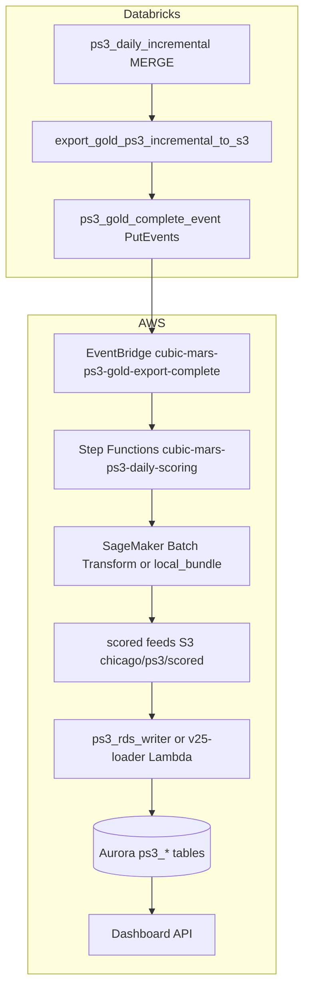
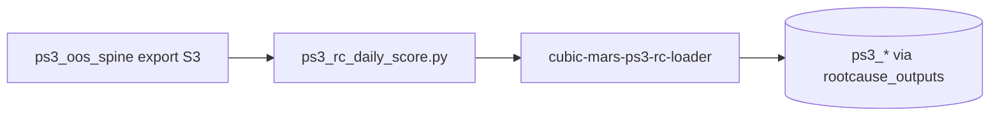
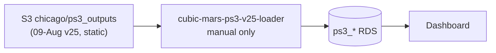

# PS3 — Root Cause & Severity Go-Live Guide

**Chicago MARS · TVM / GATE · Incident-level two-head inference**

| | |
|---|---|
| **Last updated** | 18-Aug-2026 |
| **Audience** | Engineers deploying or operating the PS3 daily pipeline |
| **Related docs** | [PS3_OOS_Redesign_Spec.md](PS3_OOS_Redesign_Spec.md), [PS1_GO_LIVE_GUIDE.md](PS1_GO_LIVE_GUIDE.md), [skills/PS1-PS5_Chicago_Status_Summary_17Aug2026.md](../skills/PS1-PS5_Chicago_Status_Summary_17Aug2026.md) |

---

## 1. What PS3 does

PS3 predicts **severity** (MAJOR vs CRITICAL collapse) and **root cause** for hardware availability incidents on fare-collection devices.

| Fleet | Scored today | Notes |
|-------|--------------|-------|
| **TVM** | Yes | Two-head model (severity + root_cause) |
| **GATE** | Yes | Two-head model |
| **VALIDATOR** | Stub / partial | ServiceNow has no availability events; OOS spine path planned |

**Gold spine (current production):** `gold.device_ps3_incident` — ServiceNow availability events filtered to cat-2 hardware faults (~34K rows, 2024-01-01 → 2026-04-11).

**OOS spine (redesign, in repo):** `ps3_oos_spine.py` / `ps3_rc_features.py` — device-native hardware OOS events; 15× label coverage vs ServiceNow path. Separate scoring path via `ps3_rc_daily_score.py`.

**Output consumers:** V4 dashboard (`/ps3/*` routes), RDS tables `ps3_incident_predictions`, `ps3_device_predictions`, `ps3_serial_predictions`, `ps3_model_runs`.

---

## 2. Executive summary — live vs pending

### What works today (production)

The **bottom half** of the V25 chain is live but **unscheduled by design**:

```
S3 static scores (09-Aug v25 production run, data as-of ~2026-04-11)
    → cubic-mars-ps3-v25-loader  (manual invoke only — no EventBridge cron)
    → Aurora ps3_* tables
    → cubic-mars-dashboard-api  (/ps3/* routes)
```

Loaders exist and work; **numbers do not advance daily** until the top half is deployed and incremental ingest lands.

### Two inference paths in the repo (do not conflate)

| Path | Scorer | Loader | Dashboard tables | Status |
|------|--------|--------|------------------|--------|
| **A — V25/V26 two-head** (main dashboard) | `sagemaker/ps3/batch_transform_daily.py` | `cubic-mars-ps3-v25-loader` | `ps3_incident/device/serial_predictions` | Production run loaded 09-Aug |
| **B — OOS root-cause redesign** | `ps3_rc_daily_score.py` | `cubic-mars-ps3-rc-loader` | `ps3_*` via rootcause_outputs prefix | Built, not on daily schedule |

**Go-live target for dashboard continuity:** Path A first. Path B is the OOS redesign track (`PS3_OOS_Redesign_Spec.md`).

### What is built but not deployed

| Component | Repo path | Deployed? |
|-----------|-----------|-----------|
| PS3 incremental gold MERGE | `databricks_daily/ps3_daily_incremental.py` | No |
| Gold export (full + incr slice) | `databricks_daily/export_gold_ps3_incremental_to_s3.py` | No |
| PutEvents trigger | `notebooks/ps3_gold_complete_event.py` | No |
| Batch scorer (V26 path) | `sagemaker/ps3/batch_transform_daily.py` | No (manual only) |
| RDS upsert | `databricks_daily/ps3_rds_writer.py` | No |
| Shared RC feature module | `ps3_rc_features.py` | Yes (extracted) |
| OOS daily scorer | `ps3_rc_daily_score.py` | No |
| Databricks job definitions | `databricks.yml` (`medallion_ps3_daily`) | No (PAUSED) |
| EventBridge + SFN scaffold | `tooling/sfn/ps3_daily_scoring.asl.json` | Template only |
| Legacy job JSON | `databricks_daily/job_ps3_daily_workflow.json` | Reference only |

### Hard gate before “new day” scores matter

Same as PS1: **incremental Oracle ingestion (12-Apr-2026 → present)** must land in gold (~23-Aug-2026 target). Without fresh `device_ps3_incident` rows, a perfect pipeline would still score nothing new.

---

## 3. Architecture

### 3.1 Target daily flow — Path A (V25/V26, designed not live)



**Key design choices (aligned with PS1 D-2/D-3):**

- **Daily scoring = batch** (SageMaker Batch Transform or `local_bundle` parity mode), **not** real-time endpoint invocations.
- **Trigger = Databricks PutEvents** (`PS3 Gold Export Complete`), never S3 bucket notifications.
- **Containerized inference:** ECR `cubic-pdm/mars-ps3` — PS3 is one of two containerized problem statements (with PS1 moving to managed Processing).
- **Endpoint retirement:** Capture `chicago-ps3-rootcause-v1` config, delete after first batch parity run.

### 3.2 OOS root-cause path — Path B (redesign)



Runs on **device-day OOS spine**, not `device_ps3_incident`. Requires daily spine export (`chicago/ps3/spine/`) — not yet wired in `databricks.yml`. Deploy Path A first; Path B follows OOS redesign cutover.

### 3.3 Current live flow (static scores)



### 3.4 Training vs daily inference

| Activity | Where | When |
|----------|-------|------|
| **Train + register model** | `PS3_RootCause_Severity_SageMaker_Source_First_V26.ipynb` | Ad hoc / retrain |
| **Refresh PS3 gold** | `ps3_daily_incremental.py` or `run_layer_gold.py` | Daily |
| **Export to S3** | `export_gold_ps3_incremental_to_s3.py` | Daily, after gold refresh |
| **Score (Path A)** | `batch_transform_daily.py` | Daily, after PutEvents |
| **Score (Path B)** | `ps3_rc_daily_score.py` | After OOS spine export |
| **Load RDS** | `ps3_rds_writer.py` or `cubic-mars-ps3-v25-loader` | After scores land |

---

## 4. Repository layout

### 4.1 Active folder (go-live + OOS Path B core)

| Path | Role |
|------|------|
| `PS3_RootCause_Severity_SageMaker_Source_First_V26.ipynb` | **Production** two-head train/deploy |
| `PS3_V26_PRODUCTION.ipynb` | Production run wrapper |
| `PS3_01_OOS_Spine_Build.ipynb` | OOS spine build (Path B) |
| `PS3_v2_OOS_Serial_SageMaker.ipynb` | OOS serial-grain training (Path B) |
| `ps3_oos_spine.py`, `ps3_oos_engine_v2.py` | OOS spine engine |
| `ps3_rc_features.py`, `ps3_rc_daily_score.py` | Daily root-cause scorer (Path B) |
| `ps3_serial_grain.py` | Serial-grain helpers (Path B) |

Reference, analysis, MLflow alternate training, and v2 builder scripts → `notebooks/_retired/ps3/`.

### 4.2 Daily pipeline — Path A (V26)

| Path | Role |
|------|------|
| `databricks_daily/ps3_daily_incremental.py` | MERGE `gold.device_ps3_incident` |
| `databricks_daily/export_gold_ps3_incremental_to_s3.py` | Full snapshot + new-incident slice |
| `notebooks/ps3_gold_complete_event.py` | Verify gold, emit EventBridge PutEvents |
| `sagemaker/ps3/batch_transform_daily.py` | Batch Transform / local_bundle / endpoint modes |
| `databricks_daily/ps3_rds_writer.py` | Idempotent RDS upsert from scored feeds |
| `sagemaker/ps3/requirements.txt` | Serving deps (`numpy<2`, pinned sklearn/xgb) |

### 4.3 Daily pipeline — Path B (OOS redesign)

| Path | Role |
|------|------|
| `ps3_oos_spine.py` | Canonical OOS spine + native labels |
| `ps3_rc_features.py` | Shared feature builder (`FEATURE_CONTRACT_VERSION`) |
| `ps3_rc_daily_score.py` | Daily root-cause inference + optional loader invoke |

### 4.4 SageMaker container

| Path | Role |
|------|------|
| `sagemaker/ps3/Dockerfile` | BYOC inference image |
| `sagemaker/ps3/inference.py` | Flask serving entrypoint |
| `sagemaker/ps3/eventbridge_schedule.json` | Alternative AWS-side cron (reference only) |

### 4.5 Retired (`notebooks/_retired/ps3/`)

All superseded notebooks, reference/analysis, and builder scripts moved 2026-08-18. See `_retired/ps3/README.md` for the full inventory.

---

## 5. S3 layout

### Buckets

| Bucket | Purpose |
|--------|---------|
| `cubic-mars-pm-s3-datalake-dev-gold-170202974600` | Gold parquet exports |
| `cubic-mars-pm-s3-datalake-dev-artifacts-170202974600` | Models, v25 outputs, rootcause_outputs |

### Key prefixes — Path A

| Prefix | Writer | Reader | Status |
|--------|--------|--------|--------|
| `chicago/gold/device_ps3_incident/` | export notebook (full overwrite) | V26 notebook EDA | Live export (static) |
| `chicago/gold/device_ps3_incident_incr/asof=<date>/` | export notebook | `batch_transform_daily.py` | **Not yet written daily** |
| `chicago/ps3/models/{tvm,gates}/` | V26 notebook | batch scorer | Static |
| `chicago/ps3/scored/<asof>/` | batch scorer | `ps3_rds_writer.py` | **Not yet written daily** |
| `chicago/ps3_outputs/` | V26 production run | `cubic-mars-ps3-v25-loader` | **Live, static 09-Aug** |

### Key prefixes — Path B

| Prefix | Writer | Reader | Status |
|--------|--------|--------|--------|
| `chicago/ps3/spine/` | (planned daily export) | `ps3_rc_daily_score.py` | Not wired |
| `chicago/ps3/rootcause_outputs/<run_id>/` | `ps3_rc_daily_score.py` | `cubic-mars-ps3-rc-loader` | Manual only |

---

## 6. AWS resources

### 6.1 SageMaker endpoint (live, idle)

| Endpoint | Model package | Invocations (30d) |
|----------|---------------|-------------------|
| `chicago-ps3-rootcause-v1` | ECR `cubic-pdm/mars-ps3` | 0 |

- **Known defect:** model package may pin `:latest` on ECR — fix to immutable digest before production retrain.
- **Planned:** Delete endpoint after first batch parity run (mirror PS1 D-4).
- **Capture required:** `tooling/out/endpoint_capture/chicago-ps3-rootcause-v1.endpointconfig.json`

### 6.2 Lambda loaders

| Function | Schedule | State | Path |
|----------|----------|-------|------|
| `cubic-mars-ps3-v25-loader` | None | **Manual only** | Path A — production dashboard |
| `cubic-mars-ps3-rc-loader` | None | **Manual only** | Path B — OOS root cause |
| `cubic-mars-ps3-v2-loader` | None | Legacy | Do not use |

### 6.3 EventBridge (planned, not created)

| Rule | Purpose | Initial state |
|------|---------|---------------|
| `cubic-mars-ps3-gold-export-complete` | PS3 PutEvents → Step Functions | DISABLED |
| `cubic-mars-ps3-sfn-failed` | SFN failure → SNS | DISABLED |
| `cubic-mars-ps3-batch-failed` | Batch Transform failure → SNS | DISABLED |
| `cubic-mars-ps3-watchdog` | No scores by cutoff → SNS | DISABLED |

Extend `tooling/ps1_eventbridge_build.sh` or create `tooling/ps3_eventbridge_build.sh` (mirror PS1 pattern).

---

## 7. Databricks jobs

Defined in `databricks.yml`:

| Job | Chain | Schedule |
|-----|-------|----------|
| **`medallion_ps3_daily`** | incremental MERGE → export S3 → PutEvents | PAUSED (07:00 Chicago) |
| **`ps3_daily_pre_score`** | export → PutEvents only | PAUSED |
| **`medallion_ps1_daily`** | (PS1 chain — separate) | PAUSED (06:00 Chicago) |

Deploy:

```bash
databricks bundle validate -t dev --profile "Sathish.Sankaran@cubic.com"
databricks bundle deploy -t dev --profile "Sathish.Sankaran@cubic.com"
```

Manual run (after deploy):

```bash
databricks bundle run medallion_ps3_daily -t dev --profile "Sathish.Sankaran@cubic.com"
```

**Instance profile requirements:**

- S3 read/write: gold bucket (`chicago/gold/device_ps3_incident*`)
- `events:PutEvents` on default EventBridge bus (ps3_gold_complete_event task)
- Read access to repo SQL files (`sql/gold`, `sql/silver`) for incremental MERGE

**Note:** `job_ps3_daily_workflow.json` is a **reference** JSON with corrected paths. Prefer `databricks.yml` for deployment. Bronze CDC (`75_CDC_INCREMENTAL_ENGINE`) is an external dependency — wire when incremental ingest is live.

---

## 8. Step-by-step go-live (mirror PS1)

### Step 1 — Archive non-production PS3 notebooks

Move superseded notebooks to `notebooks/_retired/ps3/`:

- [x] Done 2026-08-18 — V22–V25, early SageMaker notebooks, reference/analysis, builders (20 files total). See `_retired/ps3/README.md`.

### Step 2 — Pin serving dependencies

Verify `sagemaker/ps3/requirements.txt`:

```
numpy<2
pandas==2.2.2
scikit-learn==1.5.2
lightgbm==4.5.0
xgboost==2.1.1   # align to 2.1.3 if retraining on PS1 pin
joblib==1.4.2
```

Rebuild and push ECR image with **immutable tag** (not `:latest`).

### Step 3 — Feature module (mostly done)

Path B already has `ps3_rc_features.py` extracted (`FEATURE_CONTRACT_VERSION = ps3_rc_features.2026-08-03.v1`).

Path A (V26) features are inline in the production notebook — no separate module yet. For daily batch scoring, the model bundles in S3 carry the feature contract; `batch_transform_daily.py` reads bundles directly.

Optional future: extract V26 feature ETL like PS1 `ps3_features.py` — not blocking Path A go-live.

### Step 4 — AWS cleanup dry-run

```powershell
powershell -File tooling/ps3_cleanup_dryrun.ps1
```

Checks:

- ECR `cubic-pdm/mars-ps3` image tags (flag `:latest` pin)
- Endpoint capture present before deletion
- Loader Lambda states

Refresh AWS credentials if `ExpiredTokenException`.

### Step 5 — Extend `databricks.yml`

Done in repo:

- `medallion_ps3_daily` — incremental → export → PutEvents
- `ps3_daily_pre_score` — export → PutEvents only

Validate and deploy (Phase B below).

### Step 6 — EventBridge + Step Functions scaffold

Template: `tooling/sfn/ps3_daily_scoring.asl.json`

Fill placeholders:

- Batch Transform job role
- `batch_transform_daily.py` entry point (Processing job or Lambda starter)
- RDS writer / v25-loader invoke step
- SNS alert topic (can share `cubic-mars-ps1-alerts` or create PS3-specific)

Dry-run pattern (when script exists):

```bash
"C:\Program Files\Git\bin\bash.exe" tooling/ps3_eventbridge_build.sh
"C:\Program Files\Git\bin\bash.exe" tooling/ps3_eventbridge_build.sh --apply
```

### Step 7 — This document

You are reading it. Update checklist boxes as phases complete.

---

## 9. Batch scoring contract — Path A

`batch_transform_daily.py`:

```bash
python sagemaker/ps3/batch_transform_daily.py \
  --mode local_bundle \
  --asof 2026-04-11 \
  --input-s3 s3://cubic-mars-pm-s3-datalake-dev-gold-170202974600/chicago/gold/device_ps3_incident_incr/asof=2026-04-11
```

| Mode | Use |
|------|-----|
| `local_bundle` | Parity testing — loads joblib bundles from S3, no endpoint |
| `batch_transform` | Production daily — SageMaker Batch Transform on container model |
| `endpoint` | Legacy only — do not use for daily cadence |

**Outputs per fleet:** `{tvm,gates}_{incident,device,serial}_predictions.csv` under `chicago/ps3/scored/<asof>/`.

**Post-score RDS load:**

```bash
python notebooks/ps3_root_cause_analysis/databricks_daily/ps3_rds_writer.py \
  --outputs s3://.../chicago/ps3/scored/2026-04-11 \
  --city CHI --secret cubic/rds/dashboard --asof 2026-04-11
```

Or invoke `cubic-mars-ps3-v25-loader` if outputs match v25 S3 layout.

---

## 10. Go-live checklist

### Phase A — Repo ready

- [x] Archive non-production PS3 notebooks to `_retired/ps3/`
- [ ] Pin ECR image to immutable digest (fix `:latest` defect)
- [x] `ps3_rc_features.py` extracted (Path B)
- [x] Daily incremental + export notebooks exist
- [x] `ps3_gold_complete_event.py` created
- [x] Databricks job definitions in `databricks.yml`
- [x] SFN scaffold template
- [ ] **Commit and push** all changes to GitHub / Databricks repo
- [ ] **GATE parity run** — V26 metrics unchanged after any refactor

### Phase B — AWS / Databricks deploy

- [ ] Refresh AWS credentials
- [ ] `databricks bundle deploy -t dev`
- [ ] Fill SFN placeholders in `tooling/sfn/ps3_daily_scoring.asl.json`
- [ ] Create EventBridge rules (DISABLED)
- [ ] Deploy Step Functions state machine
- [ ] Confirm Databricks instance profile IAM (`events:PutEvents`)
- [ ] Rebuild ECR `cubic-pdm/mars-ps3` with pinned deps

### Phase C — Data gate (~23-Aug)

- [ ] Incremental Oracle ingest 12-Apr → present
- [ ] Gold `device_ps3_incident` max `transit_day` advances
- [ ] PS3 watermark table `audit.ps3_daily_watermark` populated

### Phase D — First supervised E2E (Path A)

- [ ] Run `medallion_ps3_daily` for one `asof_date`
- [ ] Verify full + incr parquet on S3
- [ ] Run `batch_transform_daily.py --mode local_bundle` parity vs v25 production outputs
- [ ] Load RDS via `ps3_rds_writer` or v25-loader
- [ ] Confirm dashboard vintage moves

### Phase E — Cutover and cleanup

- [ ] Enable EventBridge rules (failure rules → watchdog → gold-export-complete last)
- [ ] Endpoint capture → delete `chicago-ps3-rootcause-v1`
- [ ] Schedule v25-loader via EventBridge (replace manual invoke)
- [ ] Dashboard hygiene: data-vintage badge on PS3 screen

### Phase F — OOS redesign (Path B, later)

- [ ] Daily OOS spine export to `chicago/ps3/spine/`
- [ ] Wire `ps3_rc_daily_score.py` into SFN parallel branch
- [ ] Cut dashboard from ServiceNow spine to OOS spine per `PS3_OOS_Redesign_Spec.md`

---

## 11. Enable order for EventBridge rules

After first successful E2E:

1. Subscribe to SNS alerts topic
2. Enable `cubic-mars-ps3-sfn-failed`
3. Enable `cubic-mars-ps3-batch-failed`
4. Enable `cubic-mars-ps3-watchdog`
5. Enable **`cubic-mars-ps3-gold-export-complete` last**

Do not schedule v25-loader cron until event-driven path produces one correct run.

---

## 12. Troubleshooting

| Symptom | Likely cause | Check |
|---------|--------------|-------|
| Incremental MERGE fails on SQL path | Repo SQL path wrong in Databricks | Widget `repo_sql_gold` → bundle-relative path |
| Export writes zero incr rows | Watermark ahead of new data | `audit.ps3_daily_watermark` |
| Batch scorer skips GATE/TVM | Missing bundles on S3 | `chicago/ps3/models/{tvm,gates}/` |
| Scores differ from v25 production | Feature contract drift | Compare bundle feature lists |
| Dashboard unchanged | Loader not invoked / static prefix | Path A S3 layout vs loader env vars |
| PutEvents never fires | Job failed before last task; or IAM | Databricks run logs |
| ECR deploy non-reproducible | `:latest` pin on model package | Re-register with digest pin |
| Two PS3 scores same day | Manual loader + EventBridge both on | Disable manual invoke after cutover |

---

## 13. Alignment with target architecture (5 principles)

| Principle | PS3 repo decision | Delta |
|-----------|-------------------|-------|
| 1. Containerized inference | Yes — ECR `cubic-pdm/mars-ps3` | Daily = Batch Transform, not endpoint |
| 2. PS1 & PS3 containerized | PS3 yes; PS1 → managed Processing | As designed |
| 3. EventBridge triggers runs | PutEvents → SFN (planned) | Not live |
| 4. Trigger on full medallion complete | PS3 event after PS3 export only | Does not wait for full Raw→Bronze→Silver→Gold; add bronze CDC task when ingest live |
| 5. PS1 & PS3 similar EventBridge | Separate DetailTypes, parallel SFN branches | Shared SNS/IAM pattern |

---

## 14. Decisions reference

| ID | Decision |
|----|----------|
| **D-PS3-1** | Path A (V26 two-head) goes live first for dashboard continuity |
| **D-PS3-2** | Daily scoring = SageMaker **Batch Transform** or `local_bundle`, not endpoint |
| **D-PS3-3** | Trigger = Databricks **PutEvents** (`PS3 Gold Export Complete`) |
| **D-PS3-4** | Delete `chicago-ps3-rootcause-v1` after batch parity; **keep** ECR `mars-ps3` (live model package) |
| **D-PS3-5** | Path B (OOS spine) follows separately per redesign spec |

---

## 15. Document history

| Date | Change |
|------|--------|
| 18-Aug-2026 | Initial PS3 go-live guide mirroring PS1 Steps 1–7 |
| 17-Aug-2026 | Status summary baseline |

---

*For measured AWS inventory and loader IAM, see `tooling/out/cubic_inventory_v3_20260810T054803Z.json`.*
